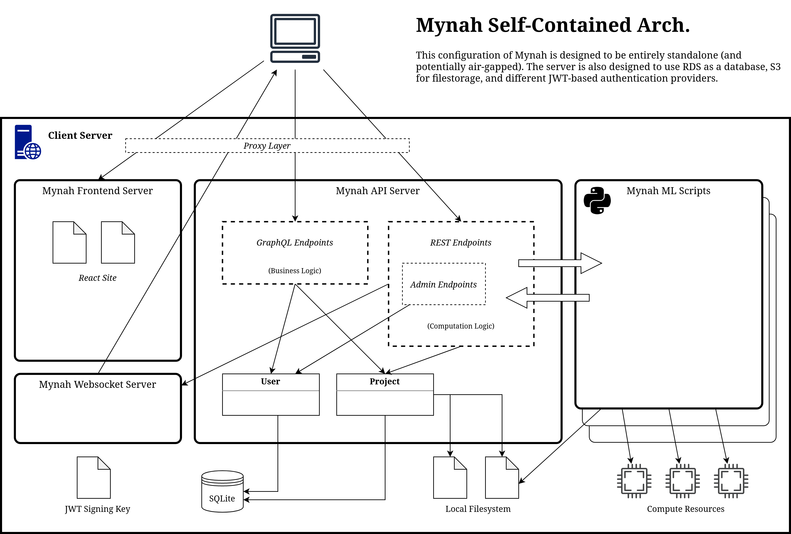

# Mynah ML Platform

## Intro
This repository combines the frontend interface and the backend api for Mynah.



### Links
- [API Design Document](docs/api_design_doc.md)
- [API Endpoint Specification](docs/endpoints.md)
- [CLI Format Specification](docs/cli_tool.md)

### Development
#### Merging and Issues
- When creating a PR/merge request, make sure to reference the issue that it closes. You can do this in the Gitlab UI by typing `#<issue id>` in the merge request description. This will automatically close the issue and makes it easier for us to maintain the connection between the issue and the code to fix it.

#### Branching
- Name your feature branches using the following format:
  - `initials/(fix/feat)-description` where `fix` is for a bug fix and `feat` is for a new feature.
  - For example, if I created a branch to fix a websockets issue I would name that branch:
    ```
    jh/fix-websocket-connections
    ```
- There are two permanent branches:
  - _Production_
    - This branch should always be stable and working
    - Frozen, LTS versions are periodically finalized from production
    - No direct commits, all merges are code reviewed
  - _Develop_
    - This branch should always be working
    - New features are merged from develop into production once code reviewed and fully tested
    - No direct commits, all development work should be done on a separate branch, squashed and merged in
- In general, all development work should be done on separate feature branches. When features are complete, these branches should be squashed (i.e. commits are combined into one) and merged into develop. Code reviews at this stage would be appropriate.
- When changes to develop are considered stable, new features are merged into production. All changes merged into production _must_ be code reviewed.

#### Logging
- Don't use the go library logger. Instead use `"reiform.com/mynah/log"`
- Functions
  - `Info, Infof` - Normal operation message
  - `Warning, Warningf` - Unexpected, bad user input, etc, may indicate integration bug
  - `Error, Errorf` - Unexpected error (not the result of user input).
  - `Fatal, Fatalf` - Exits after logging (unrecoverable)

### Testing
- We will do our best to maintain test coverage for the api and frontend. In particular, when defects are identified, these should be added as new test cases.

- To run tests:
```
make clean && make test
```

### Linting
- Setup:
```
go install github.com/securego/gosec/v2/cmd/gosec@latest
curl -sSfL https://raw.githubusercontent.com/golangci/golangci-lint/master/install.sh | sh -s -- -b $(go env GOPATH)/bin
```
Then run:
```
make lint
```

### Extensions
- [Mynah Extensions](docs/extensions.md)

## Setup

### Running the API
- **Important Note**: Running `make clean` will clear the default sqlite database location. If you want to persist your local database, change the name of the database local path in `mynah.json`. The Makefile is set to delete `data/mynah_local.db`.
- **Important Note**: Running `make clean` will delete the default configuration file `data/mynah.json`. To persist a configuration file, rename the file and pass the new path using the `-settings` flag (i.e. `./mynah -settings new_name.json`). The Makefile is set to delete `mynah.json`.
- **Important Note**: Running `make clean` will delete the default JWT private key `data/auth.pem`. To persist a JWT private key, change the name of the PEM file local path in `mynah.json`. The Makefile is set to delete `auth.pem`.

To run the api with a fresh database and configuration file:
```
make clean && make api && ./mynah
```

### Using Docker (for frontend development)
- Install Docker on your machine and run
```
docker build -t mynah:latest .
./platform/run_no_gpu.sh latest
```
- Note: in order to reset the configuration, delete `mynah_container_data_latest/`
  - (This will likely be necessary as new configuration options are added)

### Using Vagrant (for backend development)
- Install Vagrant on your machine and run
```
vagrant up && vagrant ssh
```
- Once in the VM, navigate to `/vagrant`
```
cd /vagrant
```
